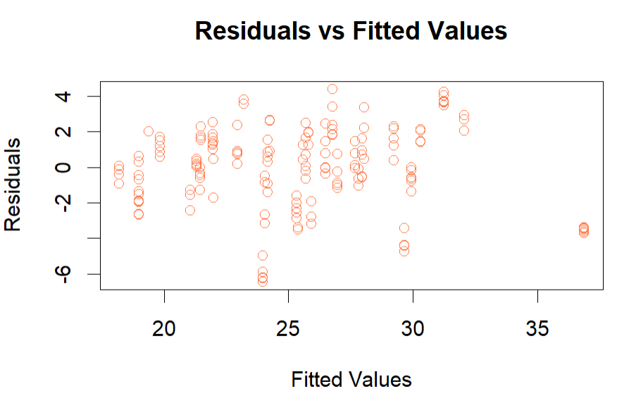

# Predictive Modeling: House Price Estimation Using Multiple Linear Regression

## Project Overview
This project presents a predictive modeling analysis conducted in R to estimate house selling prices using multiple linear regression.  
The model evaluates how property characteristics and location-related factors influence housing prices.

## Business Context
A real estate dataset containing information on residential properties was used to predict selling prices.  
Understanding the key drivers of house prices can support pricing strategies, investment decisions, and urban planning.

## Objectives
1. Build a multiple linear regression model to predict house prices  
2. Identify significant predictors affecting house prices  
3. Evaluate model assumptions and diagnostic measures  
4. Assess model performance using train-test split and cross-validation  

## Dataset
The dataset (`House_Price_Data.csv`) is included in the repository and located in the root directory.

### Dataset Description
The dataset contains **198 observations** and the following variables:
- `Price` — selling price of the house (in million Rs.)  
- `Area` — carpet area (square feet)  
- `Distance` — distance from the nearest metro station (km)  
- `Schools` — number of schools within a 2 km radius  

## Analysis Workflow
1. Data import and structure inspection  
2. Exploratory data analysis and correlation assessment  
3. Train-test split (80% training, 20% testing)  
4. Multiple linear regression model development  
5. Interpretation of regression coefficients  
6. Model diagnostics:
   - Multicollinearity (VIF)
   - Influential observations
   - Residual normality
   - Homoscedasticity  
7. Model performance evaluation (RMSE, cross-validation)

## Methods and Techniques
- Exploratory data analysis:
  - Correlation matrix
  - Scatter plot matrix
- Predictive modeling:
  - Multiple linear regression
- Model diagnostics:
  - Variance Inflation Factor (VIF)
  - Influence measures and Cook’s Distance
  - Residual analysis
- Model evaluation:
  - RMSE (training and testing)
  - K-fold cross-validation

## Key Findings
- Carpet area has a strong positive effect on house prices  
- Distance from the nearest metro station negatively impacts price  
- Proximity to schools increases house value  
- The model explains approximately **78% of the variance** in house prices  
- Similar RMSE values for training and testing data indicate good generalization performance  

## Visualization

## Tools and Skills
- R
- Predictive modeling
- Multiple linear regression
- Model diagnostics
- Cross-validation
- Real estate data analysis

## How to Run the Project
1. Clone the repository  
2. Open the R script  
3. The dataset (`House_Price_Data.csv`) is already included in the repository  
4. Run the script sequentially  

## Notes
This project was completed for educational purposes and demonstrates end-to-end predictive modeling using multiple linear regression in R.
